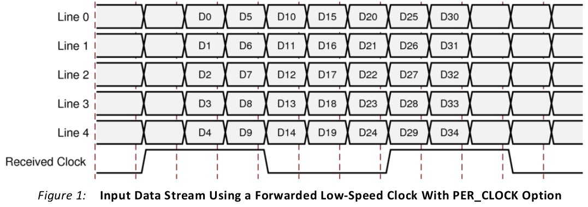
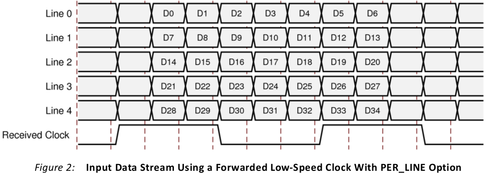
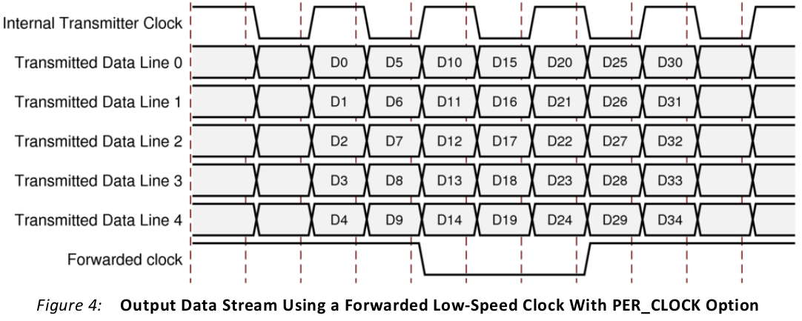
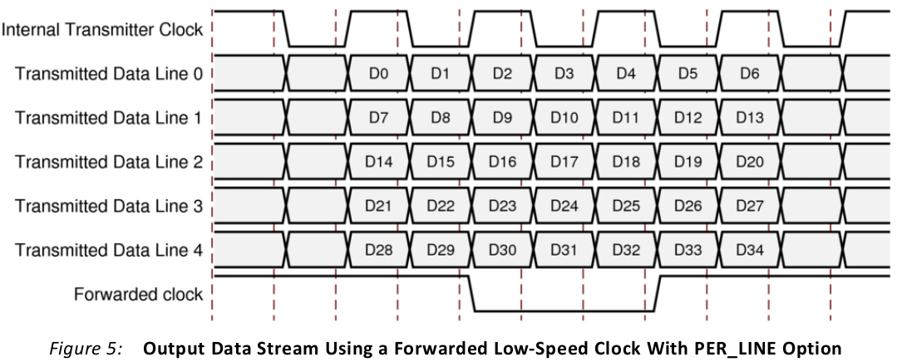
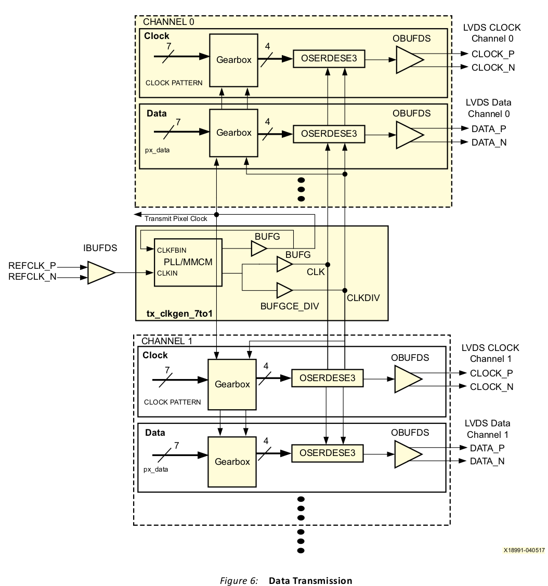

# VDS Source Synchronous 7:1 Serialization and Deserialization Using Clock Multiplication

## 요약
Xilinx® UltraScale™ 및 Ultrascale+™ FPGA에는 직렬화기 및 역직렬화기 회로의 설계를 간소화하는 ISERDESE3 및 OSERDESE3 구성 요소 모드 기본 요소가 포함되어 있습니다.

이 애플리케이션 노트는 UltraScale 및 UltraScale+ HP IO 및 HR I/O에서 7:1 데이터의 송수신을 위한 구성 요소 모드 솔루션을 설명합니다.  저전압 차동 신호(LVDS)를 사용하여 7:1 데이터의 송수신을 위해 Mixed Mode Clock Manager(MMCM) 또는 Phase-Locked Loop(PLL)와 함께 ISERDESE3 및 OSERDESE3 기본 요소를 사용하는 방법을 설명합니다.  HP I/O에서 라인당 최대 1,100Mb/s, HR I/OS에서 1000Mb/s의 데이터 전송 속도를 제공합니다.
Xilinx 웹사이트에서 이 애플리케이션 노트의 참조 설계 파일을 다운로드하세요. 설계 파일에 대한 자세한 내용은 참조 설계를 참조하세요.


## 수신기 개요
그림 1과 그림 2에 표시된 1:7 인터페이스 유형(5라인 인터페이스 표시)은 구성 요소 간에 데이터를 전달할 때 비디오 처리를 위해 텔레비전 및 블루레이 플레이어와 같은 소비자 기기에서 널리 사용됩니다. 일반적으로 하나의 비디오 채널은 5개의 LVDS 데이터 라인과 1개의 LVDS 클록 라인으로 구성됩니다. 최신 텔레비전은 여러 채널(일반적으로 4개 또는 8개)을 사용하여 적절한 비디오 대역폭을 보장할 수 있습니다. 라인당 데이터 프레이밍은 그림 1과 그림 2에 표시된 것처럼 두 가지 다른 방법으로 달성할 수 있습니다.







이 애플리케이션 노트는 단일 채널 및 다중 채널 설계에 대한 참조 설계를 제공합니다. 채널당 단일 픽셀 클록이 있으며 각 채널은 하나의 클록 곱셈 요소(MMCM 또는 PLL)를 사용합니다. 수신기는 채널당 LVDS 데이터 라인 수에 대해 매개변수화할 수 있습니다. 변수는 수신된 데이터의 데이터 프레이밍 유형(PER_CLOCK 또는 PER_LINE)도 결정합니다.

동일한 채널의 모든 라인은 동일한 뱅크에 있어야 합니다. 각 뱅크는 하나의 MMCM과 두 개의 PLL을 조합하여 최대 3개의 채널을 지원합니다. 채널의 모든 데이터 라인에 대한 내부 클록을 생성하는 입력 픽셀 클록은 글로벌 클록 가능 I/O 핀에 배치해야 합니다.


### 1:7 역직렬화 및 데이터 수신 소개
수신된 데이터 스트림은 수신 클록 속도의 배수(×7)이고 클록 신호는 수신된 데이터의 프레이밍 신호로 사용됩니다. **한 클록 주기 동안 데이터 라인의 상태 변화가 7번 발생합니다.** 널리 사용되는 예로는 카메라, 평면 패널 TV 및 모니터에 사용되는 7:1 인터페이스가 있습니다.

수신기는 8:7 분산 RAM 기반 기어박스(그림 3 참조)가 있는 1:8 DDR 모드에서 ISERDESE3를 사용하여 입력 데이터 스트림을 역직렬화하고 정렬합니다. 이 구현에는 1/2 속도 샘플링 클록(rx_clkdiv2), 1/8 속도 역직렬화된 데이터 클록(rx_clkdiv8), 원래 수신기 소스 클록과 동일한 1/7 픽셀 클록(px_clk)의 세 가지 클록 도메인이 필요합니다.

수신기 소스 클록은 VCO 주파수 범위를 충족시키기 위해 MMCM 또는 PLL에서 7 또는 14로 곱한 다음 1/2 속도 샘플링 클록(rx_clkdiv2)을 생성하기 위해 2로 나누고 패브릭 픽셀 클록(px_clk)을 생성하기 위해 7로 나눕니다. 1/8 속도 역직렬화된 데이터 클록(rx_clkdiv8)은 ISERDESE3 CLK와 CLKDIV 입력 간의 클록 스큐를 최소화하기 위해 BUFGCE_DIV를 사용하여 1/2 속도 샘플링 클록 MMCM 또는 PLL 출력에서 생성됩니다.

MMCM 또는 PLL로 직접 라우팅하는 것 외에도 입력 픽셀 클록은 IDELAYE3 요소를 통해 두 개의 ISERDESE3에 연결됩니다(그림 3 참조). 두 번째 IDELAYE3 및 ISERDESE3은 입력 표준이 차동 입력인 LVDS이기 때문에 사용할 수 있습니다. 차동 입력은 IBUFDS_DIFF_OUT을 사용할 때 연관된 두 지연 요소에 모두 연결할 수 있습니다.

마스터 지연의 초기 지연은 0으로 설정됩니다. 슬레이브 지연은 반비트 주기로 오프셋되도록 설정됩니다. 지연을 증가시키고, 샘플링하고, 마스터와 슬레이브 비트를 비교함으로써 교정 상태 머신은 DDR 샘플링 클록에 대한 이상적인 지연을 결정합니다. 이 프로세스가 완료되면 교정된 지연 값이 채널의 모든 데이터 라인에 브로드캐스트됩니다.
이 시점에서 교정 상태 머신이 완료되고 더 이상 조정하지 않습니다.
데이터 워드 정렬 및 8:7 변환은 기어박스에서 관리되며 픽셀 클록 데이터 라인에 대해 결정된 후 나머지 데이터 라인에 브로드캐스트됩니다.
수신기 구현의 예는 그림 3에 나와 있습니다.


### 포트 및 속성(수신기)

표 1은 수신기 설계의 포트를 나열합니다.

표 1: 포트: rx_channel_1to7

|          Port          |  I/O   | 설명                     |
| :--------------------: | :----: | ------------------------ |
|    clkin_p/clkin_n     | Input  | 차동 클록 입력           |
| datain_p/datain_n[n:0] | Input  | 차등 데이터 입력 버스    |
|         reset          | Input  | 비동기 인터페이스 재설정 |
|       idelay_rdy       | Input  | 비동기 IDELAYCTRL 준비   |
|       cmt_locked       | Output | MMCM/PLL 잠금 상태       |
|         px_clk         | Output | Pixel clock              |
|      px_data[n:0]      | Output | Pixel data bus           |
|        px_ready        | Output | Pixel data ready         |


표 2는 수신기 설계의 속성을 나열합니다.

표 2: 속성: rx_channel_1to7

|     속성     |   기본값   |                             설명                             |
| :----------: | :--------: | :----------------------------------------------------------: |
|    LINES     |     5      |                     입력 데이터 라인 수                      |
| CLKIN_PERIOD |   6.600    |                  입력 클록의 클록 주기(ns)                   |
|   REF_FREQ   |    300     |         IDELAYCTRL에 적용되는 기준 클록 주파수(MHz)          |
|   USE_PLL    |   FALSE    |  MMCM 대신 PLL 사용을 활성화합니다. <br />옵션: TRUE, FALSE  |
| DATA_FORMAT  | PER_CLOCK  | px_data 버스의 데이터 형식(그림 1 및 그림 2 참조)<br/>옵션: PER_CLOCK, PER_LINE |
| CLK_PATTERN  | 7'b1100011 |      정렬을 위한 7비트 클록 패턴. 예를 들어 7'b1100011       |
| RX_SWAP_MASK |   16'b0    | PCB 라우팅을 용이하게 하기 위해 라인별로 데이터 입력을 반전할 수 있습니다.<br/>예를 들어 5'b00000:<br/>0: 반전 없음<br/>1: 반전 |
|  DIFF_TERM   |   FALSE    |    내부 차등 종료를 활성화합니다. <br />옵션: TRUE, FALSE    |


### 수신기 설계 고려 사항
이 참조 설계를 사용할 때 다음 설계 고려 사항이 해결되었는지 확인하십시오.

* ISERDESE3의 CLK와 CLKDIV 포트 사이의 과도한 스큐는 패브릭 인터페이스에서 수신기 데이터 정렬 오류를 초래할 수 있습니다. 스큐를 최소화하기 위해 CLK와 CLKDIV는 그림 3에 표시된 것과 같이 동일한 MMCM/PLL 클록 출력에서 파생됩니다.
  스큐를 더욱 줄이려면 CLOCK_DELAY_GROUP 제약 조건을 사용해야 합니다. 다음은 XDC 제약 조건의 예입니다.
  이 제약 조건은 각 rx_channel_1to7 모듈에 대해 고유해야 합니다. 제약 조건은 고유한 이름(예: ioclockGroup_rx1)과 올바른 계층적 인스턴스 이름(예: rx_channel1)을 가져야 합니다.

```verilog
set_property CLOCK_DELAY_GROUP ioclockGroup_rx1 [get_nets {rx_channel1/rx_clkdiv*}]
```


* 수신기 내의 특정 경로는 타이밍이 필요하지 않으며 타이밍 클로저를 달성하기 위해 거짓 경로로 표시되어야 합니다. 다음은 XDC 제약 조건의 예입니다. rx_channel_1to7 모듈의 경우 올바른 계층적 인스턴스 이름(예: rx_channel1)을 사용해야 합니다.

```verilog
set_false_path -to [get_pins {rx_channel1/rxc_gen/iserdes_m/D}]
set_false_path -to [get_pins {rx_channel1/rxc_gen/iserdes_s/D}]
set_false_path -to [get_pins {rx_channel1/rxc_gen/px_reset_sync_reg[*]/PRE}]
set_false_path -to [get_pins {rx_channel1/rxc_gen/px_rx_ready_sync_reg[*]/CLR}]
set_false_path -to [get_pins {rx_channel1/rxc_gen/px_data_reg[*]/D}]
set_false_path -to [get_pins {rx_channel1/rxc_gen/px_rd_last_reg[*]/D}]
set_false_path -to [get_pins {rx_channel1/rxd[*].sipo/px_data_reg[*]/D}]
set_false_path -to [get_pins {rx_channel1/rxd[*].sipo/px_rd_last_reg[*]/D}]
```

교정 알고리즘이 비트 시간을 정확하게 판독하려면 IDELAYCTRL 블록을 설계의 최상위 수준에서 인스턴스화해야 하며, RDY 출력은 각 rx_channel_7to1 인스턴스화의 idelay_rdy 포트에 연결되어야 합니다. 인스턴스화 예는 아래와 같습니다. IDELAYCTRL 블록에는 200–800MHz 클록 입력이 필요합니다. 이 클록의 주파수(MHz)는 rx_channel_7to1 블록의 속성 REF_FREQ 값으로 제공됩니다.

rx_channel_7to1 인스턴스화에 대한 비동기 재설정이 해제되고 수신기 MMCM/PLL이 잠긴 후에는 IDELAYCTRL 블록(RST)의 재설정을 해제해야 합니다.

```
//
// Idelay control block
//
IDELAYCTRL #( // 입력 지연 제어 블록 인스턴스화
  .SIM_DEVICE ("ULTRASCALE")
) icontrol (
  .REFCLK (clk300_g),// IDELAYCTRL에 대한 참조 클록(범위 = 200.0~800.0MHz)
  .RST(idly_reset_int), //IDELAYCTRL에 대한 비동기 재설정
  .RDY(rx_idelay_rdy) //모든 rx_channel_7to1 인스턴스의 idelay_rdy 포트에 연결
);
assign idly_reset_int = rx_reset | !rx1_cmt_locked | !rx2_cmt_locked;
```


### 리셋 시퀀스
다음 리셋 시퀀스가 필요합니다.

1. rx_channel_1to7 리셋을 해제합니다.
2. MMCM/PLL 잠금이 어설션될 때까지 기다립니다.
3. IDELAYCTRL 리셋을 해제합니다.
4. px_ready가 어설션될 때 px_data 출력 버스가 유효합니다.


## 직렬화 및 데이터 전송 소개
필요한 출력 전달 클록 및 데이터 스트림은 동시에 상태를 변경하므로 동일한 전송 클록에서 생성될 수 있습니다. 이에 대한 예로는 카메라, 평면 패널 텔레비전 및 모니터에 사용되는 7:1 인터페이스가 있습니다(그림 4 및 그림 5 참조). 수신기와 마찬가지로 데이터 프레이밍은 PER_CLOCK 또는 PER_LINE이 될 수 있습니다. 이 참조 설계에서는 두 옵션을 모두 사용할 수 있습니다.







### Ultrascale 및 Ultrascale+ FPGA에서의 데이터 전송
전송 데이터 스트림은 수신 클록 속도의 배수(×7)이고 클록 신호는 전송된 데이터의 프레이밍 신호로 사용됩니다. 한 클록 주기 동안 데이터 라인의 상태 변화가 7번 발생합니다. 널리 사용되는 예로는 카메라, 평면 패널 텔레비전 및 모니터에 사용되는 7:1 인터페이스가 있습니다.
송신기는 7:4 분산 RAM 기반 기어박스와 4:1 DDR 모드에서 OSERDESE3를 사용하여(그림 6 참조) 출력 데이터를 직렬화합니다. 이 구현에는 3개의 클록 도메인, 1/2 속도 전송 클록(tx_clkdiv2), 1/4 속도 전송 데이터 클록(tx_clkdiv4), 원래 송신기 소스 클록과 동일한 1/7 픽셀 클록(px_clock)이 필요합니다.
송신기 소스 클록은 VCO 주파수 범위를 충족시키기 위해 MMCM 또는 PLL에서 7 또는 14로 곱한 다음 1/2 속도 전송 클록(tx_clkdiv2)을 생성하기 위해 2로 나누고 패브릭 픽셀 클록(px_clk)을 생성하기 위해 7로 나눕니다. 1/4 속도 전송 데이터 클록(tx_clkdiv4)은 OSERDESE3 CLK 및 CLKDIV 입력 간의 클록 스큐를 최소화하기 위해 BUFGCE_DIV를 사용하여 1/2 속도 전송 클록 MMCM 또는 PLL 출력에서 생성됩니다.

여러 전송 채널이 동일한 데이터 속도와 동일한 설계 내에서 작동하는 경우 단일 MMCM/PLL 및 글로벌 클록 네트워크를 공유할 수 있습니다.



### 포트 및 속성(송신기)
표 3은 송신기 채널(tx_channel_7to1.v)의 포트를 나열합니다.

표 3:포트: tx_channel_7to1.v

| Port                   | I/O    | 설명                                                         |
| ---------------------- | ------ | ------------------------------------------------------------ |
| tx_clk_p/tx_clk_n      | Output | 차동 클록 출력                                               |
| tx_out_p/tx_out_n[n:0] | Output | 차등 데이터 출력 버스                                        |
| px_data[n:0]           | Input  | 픽셀 데이터 버스, px_clk와 동기                              |
| px_reset               | Input  | 픽셀 로직을 재설정하고 px_clk와 동기화합니다.                |
| px_clk                 | Input  | 1/7 전송 속도로 실행되는 픽셀 클록                           |
| tx_clkdiv2             | Input  | 1/2 전송 속도로 실행되는 전송 클록(CLK 입력에서 OSERDESE3로) |
| tx_clkdiv4             | Input  | 1/4 전송 속도로 실행되는 전송 클록(CLKDIV 입력에서 OSERDESE3로) |


표 4는 송신기 채널(tx_channel_7to1.v)의 속성을 나열합니다.

표 4: 속성: tx_channel_7to1.v

| 속성         | 기본값      | 설명                                                         |
| ------------ | ----------- | ------------------------------------------------------------ |
| LINES        | 5           | 출력 데이터 라인 수                                          |
| DATA_FORMAT  | PER_CLOCK   | px_data 버스의 데이터 형식(그림 4 및 그림 5 참조)<br/>옵션: PER_CLOCK, PER_LINE |
| CLK_PATTERN  | 7'b11000111 | 전송 클록 비트 패턴. 예: 7'b1100011                          |
| TX_SWAP_MASK | 16'b0       | PCB 라우팅을 용이하게 하기 위해 라인별로 데이터 출력 출력을 반전할 수 있습니다.<br />예를 들어 5'b00000:<br/>0: 반전 없음<br/>1: 반전 |


표 5는 송신기 클록 생성기(tx_clkgen_7to1.v)의 포트를 나열합니다.

표 5: 포트: tx_clkgen_7to1.v

| Port       | I/O    | 설명                                    |
| ---------- | ------ | --------------------------------------- |
| clkin      | Input  | 픽셀 클럭 전송                          |
| reset      | Input  | 비동기 인터페이스 재설정                |
| px_clk     | Output | 1/7 전송 속도로 실행되는 픽셀 클록      |
| tx_clkdiv2 | Output | 전송 클럭을 2로 나눕니다(px_clk * 3.50) |
| tx_clkdiv4 | Output | 전송 클럭을 4로 나눕니다(px_clk * 1.75) |
| cmt_locked | Output | MMCM/PLL 잠금 출력                      |


표 6은 송신기 클록 생성기(tx_clkgen_7to1.v)의 속성을 나열합니다.

표 6: 속성: tx_clkgen_7to1.v

| 속성         | 기본값 | 설명                                                 |
| ------------ | ------ | ---------------------------------------------------- |
| CLKIN_PERIOD | 6.600  | 전송 클럭의 클럭 주기(ns)                            |
| USE_PLL      | FALSE  | MMCM 대신 PLL 사용을 활성화합니다. 옵션: TRUE, FALSE |


### 송신기 설계 고려 사항

이 참조 설계를 사용할 때 다음 설계 고려 사항이 해결되었는지 확인하십시오.

* OSERDESE3의 CLK와 CLKDIV 포트 사이의 과도한 스큐는 전송 데이터 정렬 오류를 초래할 수 있습니다. 스큐를 최소화하기 위해 CLK와 CLKDIV는 그림 6에 표시된 것처럼 참조 설계의 동일한 MMCM/PLL 클록 출력에서 파생됩니다.
  스큐를 더욱 줄이려면 CLOCK_DELAY_GROUP 제약 조건을 사용해야 합니다. 다음은 XDC 제약 조건의 예입니다. 올바른 계층적 인스턴스 이름(예: tx_clkgen_7to_1 모듈의 경우 tx_clkgen)을 사용해야 합니다. 여러 tx_clkgen_7to1 모듈을 사용하는 경우 제약 조건은 각 모듈에 대해 고유한 이름(예: ioclockGroup_tx)을 가져야 합니다.

```verilog
set_property CLOCK_DELAY_GROUP ioclockGroup_tx [get_nets -of [get_pins tx_clkgen/bg_txdiv2/O]]
set_property CLOCK_DELAY_GROUP ioclockGroup_tx [get_nets -of [get_pins tx_clkgen/bg_txdiv4/O]]
```


* 송신기 내의 특정 경로는 타이밍이 필요하지 않으며 타이밍 클로저를 달성하기 위해 거짓 경로로 표시해야 합니다. 다음은 XDC 제약 조건의 예입니다. 올바른 계층적 인스턴스 이름(예: tx_channel_1to7 모듈의 경우 tx_channel1)을 사용해야 합니다.

```verilog
set_false_path -to [get_pins {tx_channel1/tx_enable_sync_reg[*]/CLR}]
set_false_path -to [get_pins {tx_channel1/txc_piso/tx_data_reg[*]/D}]
set_false_path -to [get_pins {tx_channel1/txc_piso/rd_last_reg[*]/D}]
set_false_path -to [get_pins {tx_channel1/txd[*].piso/tx_data_reg[*]/D}]
set_false_path -to [get_pins {tx_channel1/txd[*].piso/rd_last_reg[*]/D}]
```


### 재설정 시퀀스

다음 재설정 시퀀스가 필요합니다.

1. MMCM/PLL에 대한 재설정 해제 (tx_clkgen_7to1.v).
2. MMCM/PLL 잠금이 어설션될 때까지 기다립니다.
3. MMCM/PLL 잠금 출력을 px_clock으로 반전하고 동기화하고 각 tx_channel_7to1의 재설정 입력에 적용합니다.


## 참조 설계

Xilinx 웹사이트에서 이 애플리케이션 노트에 대한 참조 설계 파일을 다운로드하세요. 이 파일은 Verilog에서만 사용할 수 있습니다.
이 문서 전반에 걸쳐 표시된 다양한 방법론에 대한 그림에는 해당 파일의 이름이 포함되어 있습니다. 또한 평면 패널 디스플레이 및 카메라에 사용되는 7:1 인터페이스에 대한 예제 최상위 파일과 예제 타이밍 제약도 포함되어 있습니다.
참조 설계에 포함된 파일은 표 7에 나와 있습니다.

표 7: 참조 설계 파일

| /Verilog_src      | /Verilog_sim      | /Verilog_example   |
| ----------------- | ----------------- | ------------------ |
| tx_channel_7to1.v | test_txrx_0525m.v | top_txrx_0525m.v   |
| tx_clkgen_7to1.v  | test_txrx_1050m.v | top_txrx_0525.xdc  |
| tx_piso_7to1.v    |                   | top_txrx_1050m.v   |
| rx_channel_1to7.v |                   | top_txrx_1050m.xdc |
| rx_clkgen_1to7.v  |                   |                    |
| rx_sipo_1to7.v    |                   |                    |


## 결론

Ultrascale 및 Ultrascale+ FPGA는 HP I/O의 경우 라인당 415Mb/s에서 1,100Mb/s, HR I/O의 경우 1000Mb/s의 속도로 7:1의 직렬화 및 역직렬화 계수를 필요로 하는 광범위한 애플리케이션에서 작동합니다.


## 참조


1. UltraScale Architecture SelectIO 리소스(UG571)
2. 클록 곱셈을 사용한 LVDS 소스 동기식 7:1 직렬화 및 역직렬화(XAPP585)


## 읽어주세요: 중요한 법적 고지

여기에 공개된 정보(이하 "자료")는 Xilinx 제품의 선택 및 사용을 위해서만 제공됩니다. 해당 법률에서 허용하는 최대 범위 내에서: (1) 자료는 "있는 그대로" 제공되며 모든 오류가 포함되어 있습니다. Xilinx는 상품성, 비침해 또는 특정 목적에의 적합성을 포함하되 이에 국한되지 않는 명시적, 묵시적 또는 법률적 모든 보증 및 조건을 부인합니다. (2) Xilinx는 (계약 또는 불법행위, 과실 포함, 또는 기타 책임 이론에 따라) 자료(자료 사용 포함)와 관련하거나 자료에 따라 또는 자료와 관련하여 발생하는 모든 종류 또는 성격의 손실 또는 피해에 대해 책임을 지지 않습니다. 여기에는 직접적, 간접적, 특수적, 우발적 또는 결과적 손실 또는 피해(데이터 손실, 이익, 영업권 또는 제3자가 제기한 소송의 결과로 발생한 모든 유형의 손실 또는 피해 포함)가 포함되며, 이러한 피해 또는 손실이 합리적으로 예측 가능했거나 Xilinx가 해당 가능성을 통보받았더라도 마찬가지입니다. Xilinx는 자료에 포함된 오류를 수정하거나 자료 또는 제품 사양의 업데이트를 알릴 의무가 없습니다. 사전 서면 동의 없이 자료를 복제, 수정, 배포 또는 공개적으로 표시할 수 없습니다. 일부 제품은 Xilinx의 제한적 보증의 약관에 따라야 합니다. https://www.xilinx.com/legal.htm#tos에서 볼 수 있는 Xilinx의 판매 약관을 참조하십시오. IP 코어는 Xilinx에서 발급한 라이선스에 포함된 보증 및 지원 약관에 따라야 할 수 있습니다. Xilinx 제품은 장애 안전 또는 장애 안전 성능이 필요한 애플리케이션에서 사용하도록 설계 또는 의도되지 않았습니다. 이러한 중요한 애플리케이션에서 Xilinx 제품을 사용하는 데 대한 전적인 위험과 책임은 귀하에게 있습니다. https://www.xilinx.com/legal.htm#tos에서 볼 수 있는 Xilinx의 판매 약관을 참조하십시오.

자동차 응용 프로그램 면책 조항
자동차 제품(부품 번호에 "XA"로 표시)은 ISO 26262 자동차 안전 표준("안전 설계")과 일치하는 안전 개념이나 중복 기능이 없는 한 에어백의 전개 또는 차량 제어에 영향을 미치는 응용 프로그램("안전 응용 프로그램")에서 사용하기 위해 보증되지 않습니다.
고객은 제품을 통합한 시스템을 사용하거나 배포하기 전에 안전 목적에 대한 해당 시스템을 철저히 테스트해야 합니다. 안전 설계 없이 안전 애플리케이션에서 제품을 사용하는 것은 전적으로 고객의 위험 부담이며, 제품 책임에 대한 제한을 규정하는 해당 법률 및 규정에만 따릅니다.
© Copyright 2017 Xilinx, Inc. Xilinx, Xilinx 로고, Artix, ISE, Kintex, Spartan, Virtex, Vivado, Zynq 및 여기에 포함된 기타 지정 브랜드는 미국 및 기타 국가에서 Xilinx의 상표입니다. 다른 모든 상표는 해당 소유자의 재산입니다.