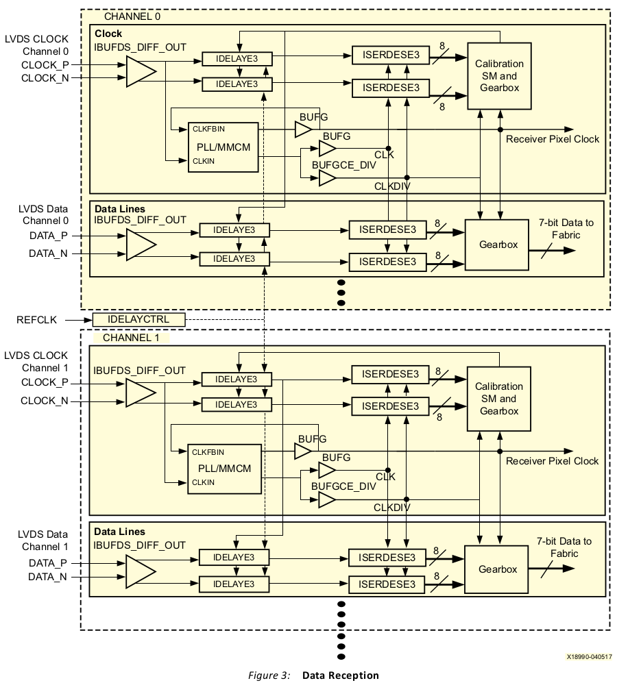

# VDS Source Synchronous 7:1 Serialization and Deserialization Using Clock Multiplication

## 요약
Xilinx® UltraScale™ 및 Ultrascale+™ FPGA에는 직렬화기 및 역직렬화기 회로의 설계를 간소화하는 ISERDESE3 및 OSERDESE3 구성 요소 모드 기본 요소가 포함되어 있습니다.

이 애플리케이션 노트는 UltraScale 및 UltraScale+ HP IO 및 HR I/O에서 7:1 데이터의 송수신을 위한 구성 요소 모드 솔루션을 설명합니다.  저전압 차동 신호(LVDS)를 사용하여 7:1 데이터의 송수신을 위해 Mixed Mode Clock Manager(MMCM) 또는 Phase-Locked Loop(PLL)와 함께 ISERDESE3 및 OSERDESE3 기본 요소를 사용하는 방법을 설명합니다.  HP I/O에서 라인당 최대 1,100Mb/s, HR I/OS에서 1000Mb/s의 데이터 전송 속도를 제공합니다.
Xilinx 웹사이트에서 이 애플리케이션 노트의 참조 설계 파일을 다운로드하세요. 설계 파일에 대한 자세한 내용은 참조 설계를 참조하세요.

## 수신기 개요
그림 1과 그림 2에 표시된 1:7 인터페이스 유형(5라인 인터페이스 표시)은 구성 요소 간에 데이터를 전달할 때 비디오 처리를 위해 텔레비전 및 블루레이 플레이어와 같은 소비자 기기에서 널리 사용됩니다. 일반적으로 하나의 비디오 채널은 5개의 LVDS 데이터 라인과 1개의 LVDS 클록 라인으로 구성됩니다. 최신 텔레비전은 여러 채널(일반적으로 4개 또는 8개)을 사용하여 적절한 비디오 대역폭을 보장할 수 있습니다. 라인당 데이터 프레이밍은 그림 1과 그림 2에 표시된 것처럼 두 가지 다른 방법으로 달성할 수 있습니다.

이 애플리케이션 노트는 단일 채널 및 다중 채널 설계에 대한 참조 설계를 제공합니다. 채널당 단일 픽셀 클록이 있으며 각 채널은 하나의 클록 곱셈 요소(MMCM 또는 PLL)를 사용합니다. 수신기는 채널당 LVDS 데이터 라인 수에 대해 매개변수화할 수 있습니다. 변수는 수신된 데이터의 데이터 프레이밍 유형(PER_CLOCK 또는 PER_LINE)도 결정합니다.

동일한 채널의 모든 라인은 동일한 뱅크에 있어야 합니다. 각 뱅크는 하나의 MMCM과 두 개의 PLL을 조합하여 최대 3개의 채널을 지원합니다. 채널의 모든 데이터 라인에 대한 내부 클록을 생성하는 입력 픽셀 클록은 글로벌 클록 가능 I/O 핀에 배치해야 합니다.

### 1:7 역직렬화 및 데이터 수신 소개
수신된 데이터 스트림은 수신 클록 속도의 배수(×7)이고 클록 신호는 수신된 데이터의 프레이밍 신호로 사용됩니다. **한 클록 주기 동안 데이터 라인의 상태 변화가 7번 발생합니다.** 널리 사용되는 예로는 카메라, 평면 패널 TV 및 모니터에 사용되는 7:1 인터페이스가 있습니다.

수신기는 8:7 분산 RAM 기반 기어박스(그림 3 참조)가 있는 1:8 DDR 모드에서 ISERDESE3를 사용하여 입력 데이터 스트림을 역직렬화하고 정렬합니다. 이 구현에는 1/2 속도 샘플링 클록(rx_clkdiv2), 1/8 속도 역직렬화된 데이터 클록(rx_clkdiv8), 원래 수신기 소스 클록과 동일한 1/7 픽셀 클록(px_clk)의 세 가지 클록 도메인이 필요합니다.

수신기 소스 클록은 VCO 주파수 범위를 충족시키기 위해 MMCM 또는 PLL에서 7 또는 14로 곱한 다음 1/2 속도 샘플링 클록(rx_clkdiv2)을 생성하기 위해 2로 나누고 패브릭 픽셀 클록(px_clk)을 생성하기 위해 7로 나눕니다. 1/8 속도 역직렬화된 데이터 클록(rx_clkdiv8)은 ISERDESE3 CLK와 CLKDIV 입력 간의 클록 스큐를 최소화하기 위해 BUFGCE_DIV를 사용하여 1/2 속도 샘플링 클록 MMCM 또는 PLL 출력에서 생성됩니다.

MMCM 또는 PLL로 직접 라우팅하는 것 외에도 입력 픽셀 클록은 IDELAYE3 요소를 통해 두 개의 ISERDESE3에 연결됩니다(그림 3 참조). 두 번째 IDELAYE3 및 ISERDESE3은 입력 표준이 차동 입력인 LVDS이기 때문에 사용할 수 있습니다. 차동 입력은 IBUFDS_DIFF_OUT을 사용할 때 연관된 두 지연 요소에 모두 연결할 수 있습니다.

마스터 지연의 초기 지연은 0으로 설정됩니다. 슬레이브 지연은 반비트 주기로 오프셋되도록 설정됩니다. 지연을 증가시키고, 샘플링하고, 마스터와 슬레이브 비트를 비교함으로써 교정 상태 머신은 DDR 샘플링 클록에 대한 이상적인 지연을 결정합니다. 이 프로세스가 완료되면 교정된 지연 값이 채널의 모든 데이터 라인에 브로드캐스트됩니다.
이 시점에서 교정 상태 머신이 완료되고 더 이상 조정하지 않습니다.
데이터 워드 정렬 및 8:7 변환은 기어박스에서 관리되며 픽셀 클록 데이터 라인에 대해 결정된 후 나머지 데이터 라인에 브로드캐스트됩니다.
수신기 구현의 예는 그림 3에 나와 있습니다.

### 포트 및 속성(수신기)

표 1은 수신기 설계의 포트를 나열합니다.